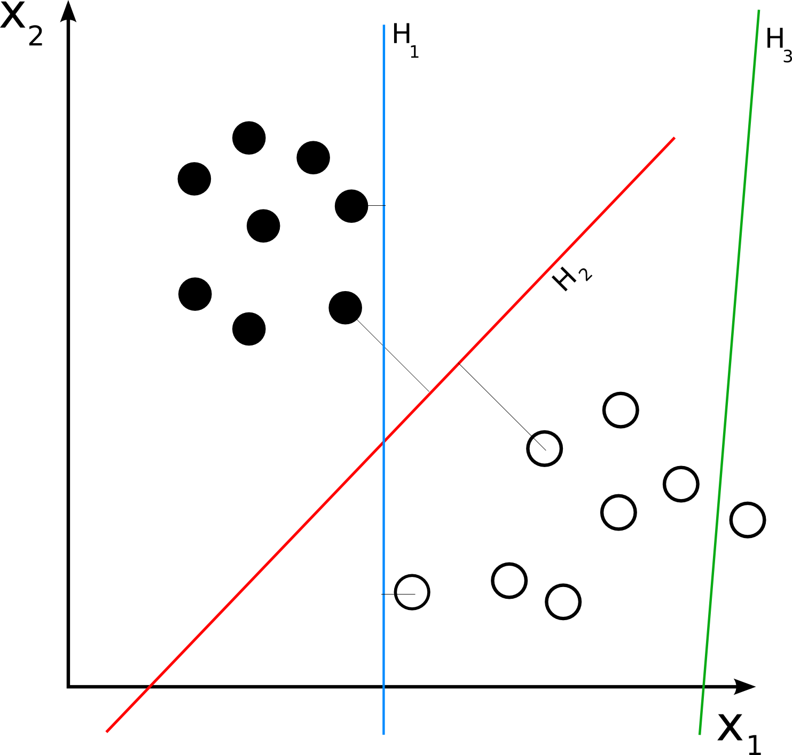
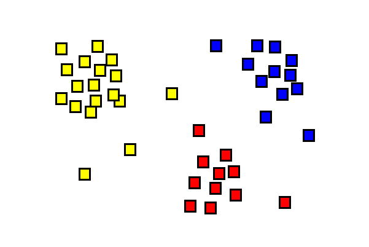

# Introduction to Machine Learning

---
# What is Machine Learning?

> [Machine Learning is the] field of study that gives computers the ability to learn
without being explicitly programmed
-Arthur Samuel, 1959

> Machine learning can b e broadly defined as computational methods using experience to improve performance or to make accurate predictions. 
-Mohri et al. (2018)

---
# What is Machine Learning?
- Example: Spam filter
    - Given some text, **classify** whether it is SPAM or HAM.
    - We don't write manual rules for this.
    - Instead, we show a machine learning algorithm many emails **labeled** SPAM or HAM and let it **learn** the difference.
        - This is called **training**, and the emails used to learn are called **training examples**.

---
# What is Machine Learning?
- Machine learning consists of designing or using algorithms that learn from experience (data).
- We use these algorithms to train a **model**.
- We can then use this model to perform some task.
    - Make predictions (spam, not spam)
    - Perform other tasks (play a game, drive a car, cluster datapoints), etc.

---
# Machine Learning Process
- Show algorithm **training examples** to **train** the model.
    - For example: show the model several spam emails labeled SPAM and several non-spam messages labeled HAM.
- Then, deploy (test) the model on some unseen **test data**.  
    - We don't just want to memorize the training data; we want to **generalize** well enough to make predictions on new examples we've never seen.

---
# Classification

    

---
# Supervised vs. Unsupervised Machine Learning
- Supervised learning uses **labeled** training examples (e.g., spam, not spam) to train a model.
- Unsupervised learning does not used labeled data (e.g., clustering.)

---
# Clustering

---
# Example Machine Learning Problems
- Classification (predict a label)
- Regression (predict a real number)
- Clustering (group similar items)
- Ranking (create a ranked list of items, e.g., search results)

---
# Examples of Machine Learning Applications
Detecting tumors, classifying news articles, speech recognition, text-to-speech, facial recognition, chatbots, digital assistants, product recommendations, flagging offensive content, self-driving cars, auto-completion, machine translation, computational biology, etc.

