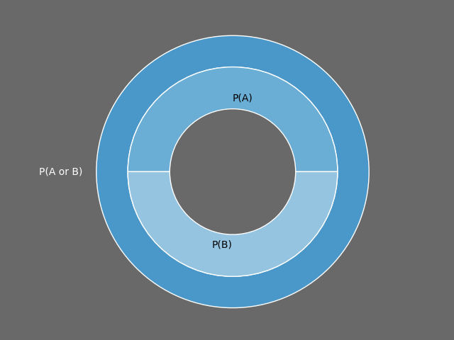
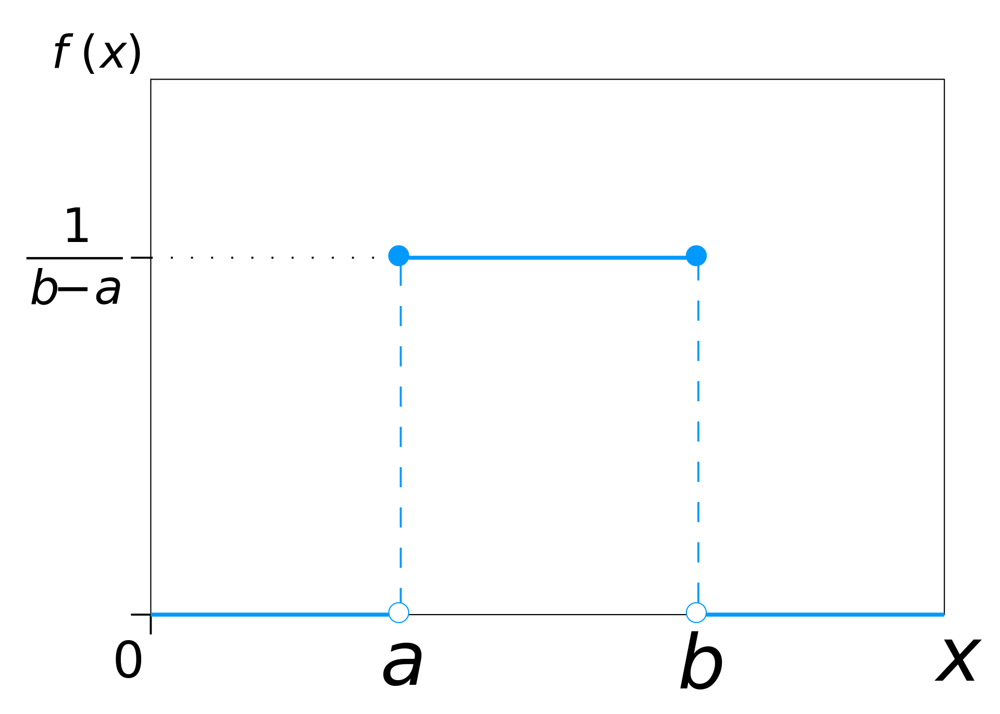

# Basic Probability and Statistics

---
# Probability

- The **probability** of an **event** $e$ has a number of epistemological interpretations
- Assuming we have **data**, we can count the number of times $e$ occurs in the dataset to estimate the probability of $e$, $P(e)$.
$$
P(e)=\frac{\text{count}(e)}{\text{count}(\text{all events})}.
$$

- If we put all events in a bag, shake it up, and choose one at random (called **sampling**), how likely are we to get $e$?

---
# Probability

- Suppose we flip a fair coin
- What is the probability of heads, $P(e=H)$?

---
# Probability

- Suppose we flip a fair coin
- What is the probability of heads, $P(e=H)$?
- We have "all" of two possibilities, $e\in\{H, T\}$.

---
# Probability

- Suppose we flip a fair coin
- What is the probability of heads, $P(e=H)$?
- We have "all" of two possibilities, $e\in\{H, T\}$.
- $P(e=H) = \frac{count(H)}{count(H) + count(T)}$

---
# Probability

- Suppose we have a fair 6-sided die.
 $$\frac{count(s)}{count(1) + count(2) + count(3) + \dots + count(6)}\\
= \frac{1}{1 + 1 + 1 + 1 + 1 + 1} = \frac{1}{6}$$

---
# Probability

- What about a die with on ly three numbers $\{1, 2, 3\}$, each of which appears twice?

- What's the probability of getting "1"?

---
# Probability

- What about a die with only three numbers $\{1, 2, 3\}$, each of which appears twice?

- What's the probability of getting "1"?

$$P(e = 1) = \frac{count(1)}{count(1) + count(2) + count(3)}$$

---
# Probability

- What about a die with on ly three numbers $\{1, 2, 3\}$, each of which appears twice?

- What's the probability of getting "1"?

$$P(e = 1) = \frac{count(1)}{count(1) + count(2) + count(3)} \\
= \frac{2}{2 + 2 + 2} = \frac{1}{3}.$$

---
# Probability

- The set of all probabilities for an event $e$ is called a **probability distribution**

- Each die roll is an independent event (Bernoulli trial).

---
# Probability

- Which is greater, $P(HHHHH)$ or $P(HHTHH)$?

---
# Probability

- Which is greater, $P(HHHHH)$ or $P(HHTHH)$?
- Since the events are independent, they're equal

---
# Probability Axioms
1. Probabilities of events must be no less than 0. $P(e)\geq 0$ for all $e$.

2. The sum of all probabilities in a distribution must sum to 1.  That is, $P(e_1) + P(e_2) + \ldots + P(e_n) = 1$.  Or, more succinctly, 
   $$
   \sum_{e\in E}P(e) = 1.
   $$

3. The probability that one or both of two independent events $e_1$ and $e_2$ will occur is the sum of their respective probabilities.  
   $$
   P(e_1\;\textrm{or}\; e_2) = P(e_1 \cup e_2) = P(e_1) + P(e_2)\; \textrm{when}\;e_1 \cap e_2 = \emptyset
   $$

---
# Probability Disjunction
Probability space of two independent events, A and B

---
# Joint Probability

 The probability that two independent events $e_1$ and $e_2$ *both* occur is given by their product.
   $$
   P(e_1 \land e_2) = P(e_1 \cap e_2) = P(e_1)P(e_2)\; \textrm{when}\;e_1 \cap e_2 = \emptyset
   $$
- Intuitively, think of every probability as a *scaling factor*.
- You can think of a probability as the fraction of the probability space occupied by an event $e_1$.
    - $P(e_1 \land e_2$) is the fraction of of $e_1$'s probability space wherein $e_2$ also occurs.
    - So, if $P(e_1)=\frac{1}{2}$ and $P(e_2)=\frac{1}{3}$, then $P(e_2,e_2)$ is a third of a half of the probability space or $\frac{1}{3}\times\frac{1}{2}$.

---
# Joint Probability

---
# Conditional Probability

- A **conditional probability** is the probability that one event occurs given that we take another for granted. 

- The probability of $e_2$ given $e_1$ is $P(e_2 \mid e_1)$.
- This is the probability that $e_2$ will occur given that we take for granted that $e_1$ occurs.

---
# Conditional Probability

If $e_1$ and $e_2$ are independent, then 
$$
P(e_1)(e_2 | e_1) = P(e_2, e_1) \\
= P(e_2 \cap e_1) \\
= P(e_1)P(e_2)\\

= P(e_1 \cap e_2)\\ 
= P(e_1)P(e_2).
$$

---
# Conditional Probability

If $e_1$ and $e_2$ are independent, then 
$$
P(e_1)P(e_2 | e_1) = P(e_2, e_1) \\
= P(e_2 \cap e_1) \\
= P(e_1)P(e_2)\\

= P(e_1 \cap e_2)\\ 
= P(e_1)P(e_2).
$$

- But what if they're not independent?

---
# Conditional Probability
In general,
$$
P(B|A)=\frac{P(A\cap B)}{P(A)}
$$
when $P(A)\neq0$.

---
# Conditional Probability

$$
P(B|A)=\frac{P(A\cap B)}{P(A)}
$$
Suppose we have some probabilities of properties of toys:
 $P(\text{round})=0.3$ and $P(\text{blue},\text{round})=0.2.$
Then, $P(\text{blue}|\text{round})$ is the fraction of the round toys that are also blue.
$$
P(\text{blue}|\text{round})=\frac{P(\text{blue},\text{round})}{P(\text{round})}=\frac{0.2}{0.3}=0.667
$$
Answers question: If we know that the toy is round, how likely is it to be blue?
Interpretation: Denominator is the probability space of round toys; numerator giving us the fraction of that space containing blue toys.

---
# Probability Distribution Functions

- Ultimately, a probability function is a *mathematical function* called a **probability distribution**.
- Input a value or values and get a probability
 $$P(x)=p$$
 - Some are discrete; others are continuous.
 - All possible inputs must sum to 1.

---
# Probability Distribution Functions
- Like any other function, probability functions can be graphed.
- There are several common distributions.

---

# Probability Distribution Functions
Continuous Uniform Distribution

---
# Probability Distribution Functions
Discrete Uniform Distribution

---
# Probability Distribution Functions
- Normal/Gaussian Distribution

---
# Conditional Probability Distributions
$$P(X |Y)$$
* Still a probability distribution, as always.
* All inputs must still sum to 1.
* How do we find cumulative probability for continuous vs. discrete distributions?

---
# Joint/Multvariate Probability Distributions
$$P(X,Y)$$

---
# Marginal Probability Distributions
- Given a discrete joint probability distribution function
$$P(X,Y),$$
how would we find
$$P(X)?$$

---
# Marginal Probability Distributions
Given a discrete joint probability distribution function $P(X,Y),$ how would we find
$P(X)?$
- "Marginalize out" the $Y$.
    - Sum up all $y$'s.
- Discrete Case: $p(x)=\sum\limits_{y\in Y} P(x,y)$

---
# Marginal Probability Distributions
Given a discrete joint probability distribution function $P(X,Y),$ how would we find
$P(X)?$
- "Marginalize out" (fix) the $Y$.
- Discrete Case: $p(x)=\sum\limits_{y\in Y} P(x,y)$
- Continuous Case: $p(x)=\int p(x,y)dy$

---
# Marginal Probability Distributions
Given a discrete joint probability distribution function $P(X,Y),$ how would we find
$P(X)?$
- "Marginalize out" (fix) the $Y$.

