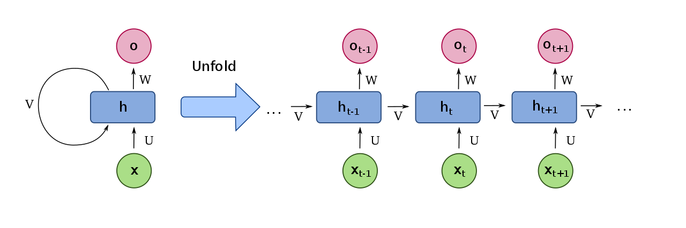
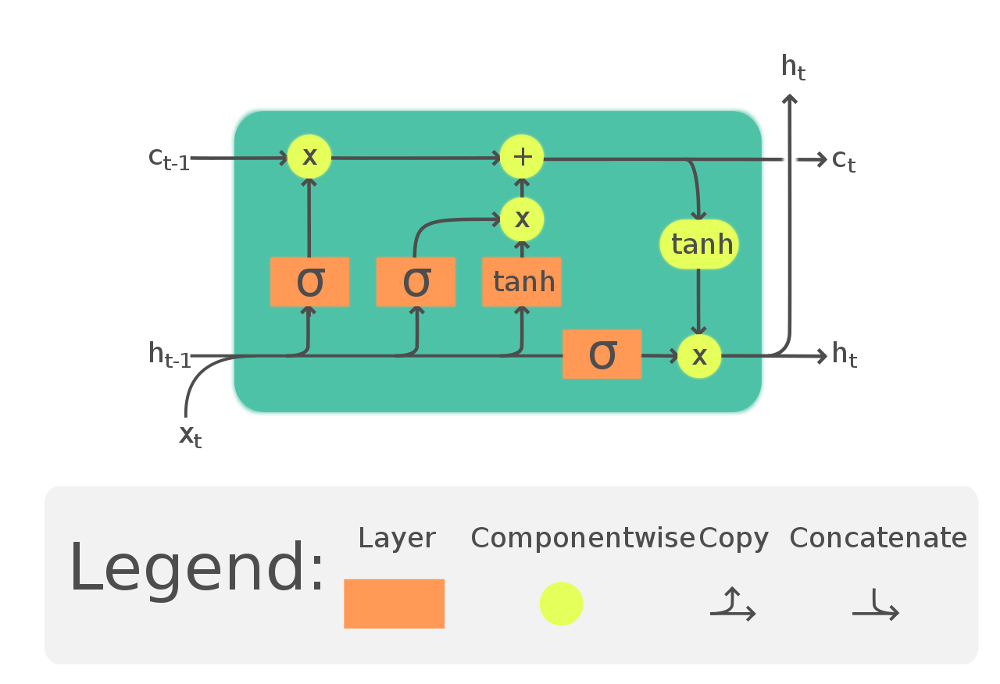

Computational Linguistics Primer (Draft)

Alvin Grissom II

# Recurrent Neural Networks

I'll now give a high-level overview of recurrent neural networks to provide some intuition to the reader before delving into denser materials.

Language modeling can be done with feed forward neural networks (multi-layer perceptrons), or even a logistic regression, by simply using the prior $n$ words or $n$-grams as features, with the output of the network being the word in the vocabulary with the highest probability, as determined by softmax.  The idea of using longer histories, beyond, say, the previous three words, is, however, appealing.  This would enable models to use much more context for their predictions.  Recurrent neural networks (RNNs) -- not to be confused with recursive neural networks, which have fallen out of favor -- are a popular way of achieving this.

While the neurons in a feed forward neural network are simple linear combinations sent through an activation function (e.g., perceptions or logisitc regressions), the neurons in an RNN are more complex.  They loop the output of the neuron back into the same neuron as input.

On the left, we have a standard "vanilla" RNN neuron.  Its input sequence is $\mathbf{x}$, which can be broken down into $x_1, x_2, \cdots, x_T$.   For a sequence, the current word is word $w_t $.  The vector $x$ is parameterized (multiplied) by a weight matrix $U$.  The recurrent neuron has its own **hidden state**, $\mathbf{h}$, which you can think of as the neuron's "memory" from previous time steps  This hidden state is then parameterized by $W$ to generate the output.  The loop redirects the hidden state $\mathbf{h}$ back into itself on subsequent time steps, parameterizing it by $V$.  Unlike a perceptron or logistic regression neuron, we have three matrices, hidden state "memory," and a loop to preserve information from previous time steps.

On the right, we have the "unrolled" version of this RNN unit, where the sequence processing steps are shown explicitly and the recurrence is shown linearly.  The input $\mathbf{x}$ is a *sequence*, rather than a disconnected set of inputs.  When word $x_{t-1}$  is processed, it's multiplied by $U$ to determine the hidden state $h_{t-1}$. This hidden state is then multiplied by $W$ to generate $o_{t-1}$.  But The hidden state $\mathbf{h}_{t-1}$ is also multiplied by $V$, which replaces $\mathbf{h}_{t-1}$ with $\mathbf{h}_{t}$.  This process continues until the entire sequence is processed.  The prediction $\hat{y}$ would usually be determined with a $\text{softmax}$ activation.

The intuition behind the hidden states is that, since previous states of the hidden state influence the future states, the network can use information about the inputs arbitrarily far in the past.  In reality, RNNs only remember a few steps in the past, because the influence decays rather quickly.  Backpropagation is used to set the parameters in the neuron; it's known as backpropagation through time (BPTT).

There are many variations of this architecture, and they often have nonlinearities, e.g., $\tanh$, as part of the multiplicative steps.  Additionally, what the cells are shown and output also varies.  E.g., one may want to output an entire sequence or just the final word, and one might want to show the correct answer at every step (teacher forcing) or not.  To understand a particular architecture or learning teachnique, consult documentation for said implementation.

As with FFNNs, the input to RNNs will usually be word embeddings, but there's nothing preventing one from using one hot vector representations.  

## LSTMs and GRUs

Vanilla RNNs have a problem, called the **vanishing gradient problem**, which limits the influence of words further back in time.  (This is also a problem for especially deep FFNNs.). In short, when taking the gradient of nested composite functions for backpropagation, we use the chain rule.  This means that the gradient requires multiplying many small numbers together, leading to a small loss: the further "back in time" we go, the more small numbers must me multiplied to propagate the error.  Since the model learns by adjusting the weights according to the loss, if this loss is vanishingly small, the model will not learn.

A more sophisticated RNN architecture that deals with this is the **long short-term memory unit** (LSTM), which introduces **gates** -- similar to logic gates -- into the neuron.  These gates allow the LSTM to explicitly store information in its "memory" for use at later time steps.  There are several versions.  

In the above figure, the gates are represented by $\sigma$, which are logistic functions.  If the output is greater than 0.5, the information passed through is kept; otherwise, it is discarded.   The $\times$ and $+$ circles represent multiplication and addition, respectively, and $x[t]$ is the input at time $t$.  The arrow running through at the top of the cell represents the path of information through the cell, which is then sent back to itself in some form on the right side of the arrow.  It's the **cell state**, which carrys "memory"  to future time steps.  

The hidden state $h_{t}$, like the cell state,  also holds  "memory" of the cell, but it is output; this is also passed back into the cell itself.  You can see that $h_{t-1}$ enters the cell on the left and $x_t$ enters the cell from the bottom.  The input $x_t$ is then sent through multiple paths.  The first $\sigma$ is the "forget gate."  The second is the "carry gate."  The intution is that one gate will discard information while the other will save it.  In reality, BPTT will decide how these gates are used. The output to both can be multiplied by the hidden state, just at different points in the process.  The $\tanh$ activation function, which is similar to $\sigma$ but flatter, with asymptotes between -1 and 1, is the last step before the new hidden state is output.  Ultimately, all that's happening during inference is that a several dot products are being added up, shunted through sigmoid gates, combined with the hidden state $h_{t-1}$, and then sent through a $\tanh$ to create the new hidden state $h_{t}$.

Gated recurrent units (GRUs), shown above, came much later, and can be thought of as simplified LSTMs.  They only have a hidden state, but no cell state, with fewer gates.

In practice, LSTMs and GRUs perform similarly on language tasks, and you likely won't be thinking about what's going on inside of them in real applications unless you're working on a research question for which this is relevant. 

There are also **bidirectional** RNNs, including bidirectional LSTMs (BiLSTMs) and GRUs (BiGRUs).  They work similarly, but they  carry information both forwards and backwards. 

